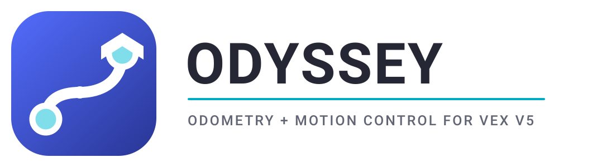

<p align="center">
  
</p>

<p align="center">
  <a href="https://jonahchang207.github.io/odyssey/"></a>
  <a href="https://github.com/jonahchang207/odyssey/releases/latest"></a>
  <a href="LICENSE"></a>
</p>

**Odyssey** is an odometry and motion control template for VEX V5, built on
[PROS](https://pros.cs.purdue.edu/). It tracks your robot's (x, y, heading)
position on the field and gives you autonomous motions that use it — PID
turns and drives, boomerang `moveToPose`, and pure pursuit path following —
inspired by [LemLib](https://github.com/LemLib/LemLib) and
[EZ-Template](https://github.com/EZ-Robotics/EZ-Template).

An optional Monte Carlo localization layer can run from V5 Distance Sensors in
shadow mode, while preserving raw odometry as the default driving pose. See the
[MCL architecture and validation guide](docs/explanation/monte-carlo-localization.md).

## 📖 Documentation

**Everything lives at [jonahchang207.github.io/odyssey](https://jonahchang207.github.io/odyssey/)** —
installation, hardware setup, tuning guides, tutorials, and the full API
reference.

## Quick install

```sh
pros c add-depot odyssey https://raw.githubusercontent.com/jonahchang207/odyssey/depot/stable.json
pros c apply odyssey    # inside your PROS project
```

## Contributors

- **[Jonah Chang](https://github.com/jonahchang207)** — creator & maintainer

## License

MIT — see [LICENSE](LICENSE).
