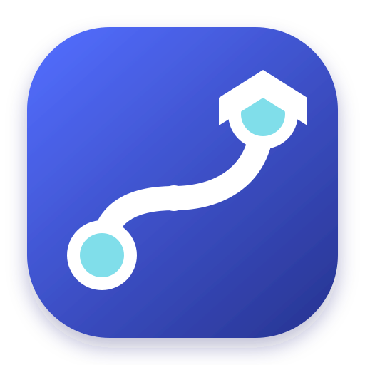
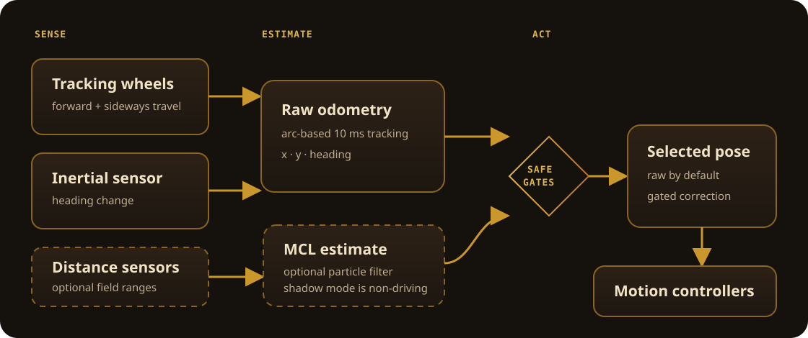

---
hide:
  - toc
---

<div class="odyssey-hero" markdown>

<div class="odyssey-hero__copy" markdown>

<span class="odyssey-eyebrow">:material-navigation-variant: Odometry + motion control for VEX V5</span>

# Know where your robot is. Tell it where to go.

Odyssey gives a PROS robot a live field pose and a practical autonomous
toolkit—from reliable turns to smooth paths—without hiding the math when you
need to debug it.

[Install Odyssey](getting-started/installation.md){ .md-button .md-button--primary }
[Build your first autonomous](getting-started/first-autonomous.md){ .md-button }

</div>

<div class="odyssey-hero__mark">
  
  <strong>Locate · Plan · Move</strong>
</div>

</div>

<div class="odyssey-quickstart" markdown>

## From zero to installed

Have a PROS project already? Register the depot once, then apply Odyssey in
your project:

```sh
pros c add-depot odyssey https://raw.githubusercontent.com/jonahchang207/odyssey/depot/stable.json
pros c apply odyssey
```

[See prerequisites and every install option →](getting-started/installation.md)

</div>

## Pick your route

<div class="odyssey-paths" markdown>

- **New to Odyssey**

    Go from hardware choices to a moving autonomous routine in five focused
    steps. [Start with installation →](getting-started/installation.md)

- **Ready to configure**

    Describe your motors, sensors, tracking wheels, drivetrain, and PID
    controllers. [Configure your chassis →](getting-started/configuration.md)

- **Tuning on the field**

    Tune turns first, then lateral motion, and diagnose odometry drift by what
    the robot does. [Open the tuning guide →](tutorials/tuning.md)

- **Building a route**

    Chain point and pose motions, trigger mechanisms mid-drive, or follow a
    path from the SD card. [Write an autonomous →](getting-started/first-autonomous.md)

- **Looking up a method**

    Check exact signatures, defaults, units, and parameter structs for every
    public motion. [Browse the Chassis API →](api/chassis.md)

- **Exploring localization**

    Understand the optional distance-sensor particle filter, correction gates,
    telemetry, and validation process. [Explore MCL →](explanation/monte-carlo-localization.md)

</div>

## One pose, every motion

Tracking wheels and an IMU produce raw odometry. Motion controllers consume the
selected pose, while the optional MCL layer can run in shadow mode or provide a
carefully gated correction. Raw odometry remains the default and the fallback.

{ .odyssey-diagram }

[Learn the coordinate system](getting-started/coordinates.md){ .md-button }
[See how odometry works](explanation/odometry-math.md){ .md-button }

## Autonomous code that reads like a route

Once the chassis is [configured](getting-started/configuration.md) and
[tuned](tutorials/tuning.md), motions use field coordinates in inches and
compass headings in degrees:

```cpp
void autonomous() {
    chassis.setPose(0, 0, 0);              // start at the origin, facing +y
    chassis.moveToPoint(0, 24, 4000);      // drive 24 inches forward
    chassis.turnToHeading(90, 1000);       // face right
    chassis.moveToPose(24, 24, 90, 4000);  // arrive at a pose in one arc
    chassis.follow("skills.txt", 12, 8000); // follow a path from the SD card
}
```

!!! info "Motions are asynchronous by default"
    Calls return immediately and queue safely. Use `waitUntil(10)` to trigger a
    mechanism 10 inches into a drive, or `waitUntilDone()` when you need an
    explicit synchronization point.

## Built for the realities of a VEX robot

<div class="odyssey-features" markdown>

- **Sensor-flexible odometry**

    Use dedicated tracking wheels, drive encoders, an IMU, or a practical
    combination. Odyssey includes sensible fallbacks when hardware is missing.

- **Competition-ready motions**

    PID turns and drives, swing turns, boomerang pose control, speed limits,
    exit conditions, slew control, and motion chaining.

- **Pure pursuit paths**

    Follow waypoints declared in code or paths drawn in
    [path.jerryio](https://path.jerryio.com/) and loaded from micro SD.

- **Driver-control helpers**

    Tank, arcade, and curvature drive with optional exponential input curves,
    deadbands, and minimum output.

- **Optional MCL safety layer**

    Run distance-sensor localization without affecting motion, then enable
    correction only after freshness and confidence gates pass.

- **Inspectable by design**

    Public API references, implementation math, telemetry, deterministic MCL
    tests, and replay tooling are documented alongside the tutorials.

</div>

## The recommended first run

1. [Install the template](getting-started/installation.md) into a PROS project.
2. [Choose and measure your hardware](getting-started/hardware.md).
3. [Configure the chassis](getting-started/configuration.md) in `src/main.cpp`.
4. [Set your field origin](getting-started/coordinates.md) and verify headings.
5. [Run a short autonomous](getting-started/first-autonomous.md), then
   [tune the controllers](tutorials/tuning.md).

<div class="odyssey-next" markdown>

<p><strong>Ready to put it on a robot?</strong><br>Start with the required tools and the two install commands.</p>

[Begin installation →](getting-started/installation.md)

</div>

Odyssey is MIT licensed and inspired by
[LemLib](https://github.com/LemLib/LemLib),
[EZ-Template](https://github.com/EZ-Robotics/EZ-Template), and 5225A Pilons'
[Introduction to Position Tracking](http://thepilons.ca/wp-content/uploads/2018/10/Tracking.pdf).
[View the source](https://github.com/jonahchang207/odyssey) or
[download the latest release](https://github.com/jonahchang207/odyssey/releases/latest).
